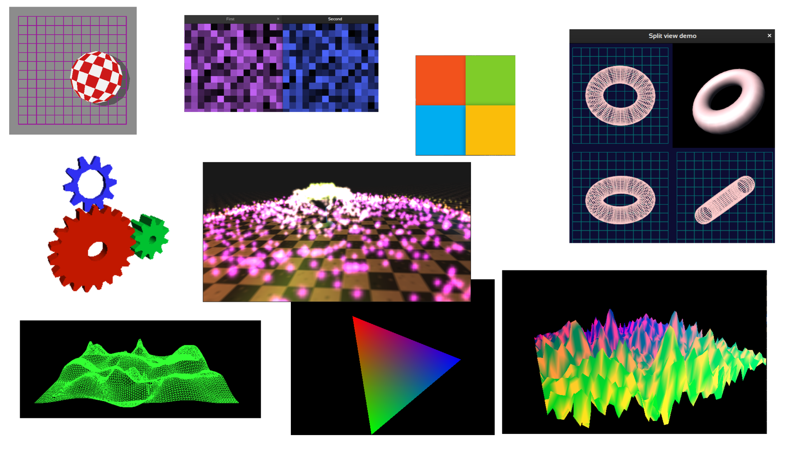

# OpenGL in C with GLFW and GLAD

Boilerplate Code to get OpenGL rendered.
Example code taken from: https://github.com/glfw/glfw/tree/master/examples

## What is GLFW?

GLFW is an Open Source, multi-platform library for OpenGL, OpenGL ES and Vulkan development on the desktop. It provides a simple API for creating windows, contexts and surfaces, receiving input and events.

GLFW is written in C and supports Windows, macOS, the X Window System and the Wayland protocol.

GLFW is licensed under the zlib/libpng license.

## What is GLAD?

GLAD is a function loader for OpenGL.

Since there are many different versions of OpenGL drivers, the location of most of its functions is not known at compile-time and needs to be queried at run-time.

Setup of GLAD involves using a web server to generate source and header files specific to your GL version, extensions, and language. The source and header files are then placed in your project's src and include directories.

## What is stb?

Sean Barrett's: 
single-file public domain (or MIT licensed) libraries for C/C++ 

Noteworthy: 

image loader: stb_image.h 
image writer: stb_image_write.h 
image resizer: stb_image_resize.h 
font text rasterizer: stb_truetype.h 
typesafe containers: stb_ds.h 
Most libraries by stb, except: stb_dxt by Fabian "ryg" Giesen, stb_image_resize by Jorge L. "VinoBS" Rodriguez, and stb_sprintf by Jeff Roberts.

https://github.com/nothings/stb 

Check also: Math for Game Developers by Jorge L. Rodriguez — Kickstarter 

## What is TinyCThread?

TinyCThread is a minimal, portable implementation of basic threading classes for C. They closely mimic the functionality and naming of the C11 standard, and
should be easily replaceable with the corresponding standard variants.

## Set up

`sudo pacman -S glfw`

https://glad.dav1d.de/
https://github.com/glfw/glfw/blob/master/deps/linmath.h
https://github.com/nothings/stb/blob/master/stb_image_write.h

## What is ARB?

ARB Approval
Proprietary extensions which prove their worth can become ARB approved (such as GL_ARB_multitexture) and shortly after become core. Most likely, an extension is already of type EXT, then becomes ARB, then core. In some cases, but not many, a proprietary extension becomes ARB, then core. Often, the original extension's developer allows other companies to also code it into their drivers without royalty requirements.

In some cases, there are differences between extension and the core function. GLSL's extension version (ARB_shader_objects) was rather different from the core 2.0 functionality.

## References

glfw 
https://www.glfw.org/ 
https://www.glfw.org/documentation.html 
https://www.glfw.org/docs/latest/quick.html 
https://www.glfw.org/docs/latest/build_guide.html 

https://learnopengl.com/Getting-started/Creating-a-window 

https://www.khronos.org/opengl/wiki/OpenGL_Extension 

Multisampling 
https://www.khronos.org/opengl/wiki/Multisampling 
https://www.khronos.org/registry/OpenGL/extensions/ARB/ARB_multisample.txt 
https://nehe.gamedev.net/tutorial/fullscreen_antialiasing/16008/ 
